#### 7z

    一种文件压缩格式，具有高压缩比率，进行数据压缩有多种压缩算法可以选择。与其它压缩格式相比，得到的压缩文档较小，即压缩率最高，节省磁盘空间。

#### 7-Zip：http://www.7-zip.org/

    完全免费而且开源的压缩软件，相比其他软件有更高的压缩比但同时耗费的资源也相对更多。支持压缩/ 解压缩：7z, XZ, BZIP2, GZIP, TAR, ZIP,WIM

#### 常用的压缩格式有:

	zip：
		一种规范开放的压缩文件，压缩算法主要使用 DEFLATE

	tar:
		tar是Linux常见的一种归档文件格式（原生不包括压缩功能，压缩率最差），tar一般和其他没有文件管理的压缩算法文件结合使用，用tar打包整个文件目录结构成一个文件，再用gzip，bzip等压缩 。是Linux常见的压缩归档的处理方法。

	7z：
		算法主要用lzma，7z的文件和管理程序都是开源的。

	rar:
		RAR有专利保护，特别是编码也就是压缩程序是私有的。

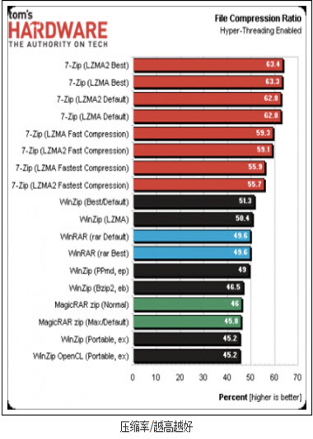
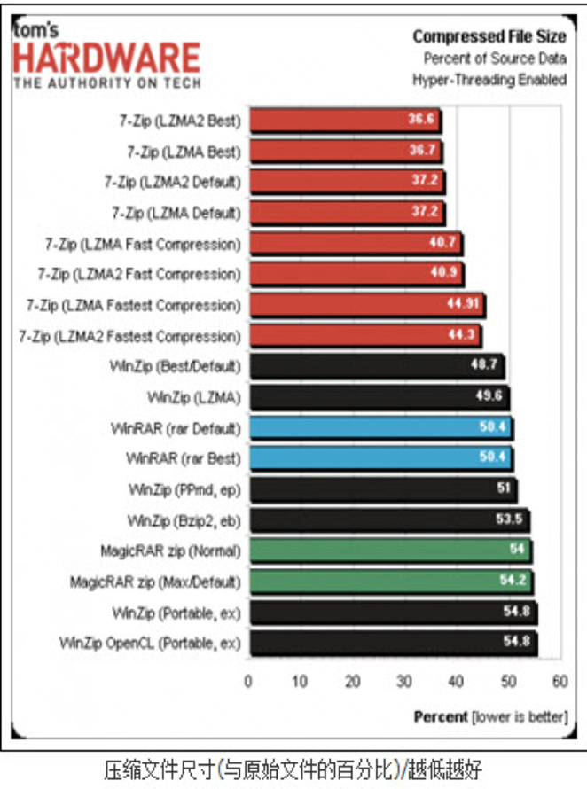

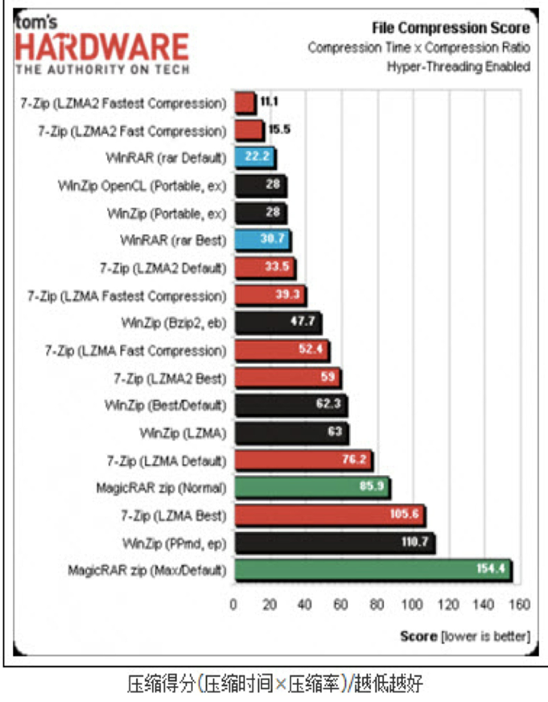
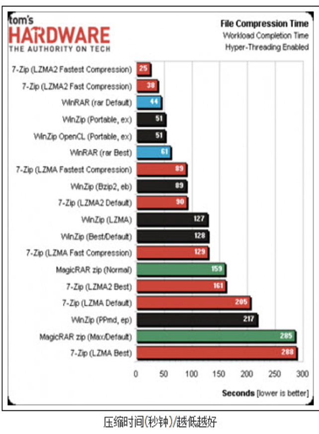

## 7zip的使用

### 1、命令行使用

http://www.7-zip.org/

可以在这里下载工具，安装之后有一个 `7z.exe` ，可以在 `cmd` 中执行

    压缩命令：7z a  [输出文件] [待压缩文件/目录] -mx=压缩等级
                -t7z 	压缩文件的格式为7z(压缩zip则为-tzip)
                -mx=9	设置压缩等级为极限压缩

    解压命令：7z x [压缩文件]  -o[输出目录]

    压缩等级：
        0   不压缩
        1   快速压缩
        5   正常压缩
        7   最大压缩
        9   极限压缩

### 2、Android命令行的实现

网页下载：

https://sourceforge.net/projects/p7zip/files/

https://jaist.dl.sourceforge.net/project/p7zip/p7zip/

命令行下载：

	wget https://jaist.dl.sourceforge.net/project/p7zip/p7zip/16.02/p7zip_16.02_src_all.tar.bz2

命令行使用

    Runtime.getRuntime().exec(“xxx”)
    7z的使用不需要对执行过程进行干预，也就是不需要在执行过程中操作数据，只在乎最后得到一个7z文件或者解压出7z文件。因此可以使用命令行来使用7zip压缩与解压。(同理对于视频文件的压缩、转换也可以使用ffmpeg命令行，但是对于实时编码摄像头数据就必须编码完成)

    7z： 使用了插件，能进行更多的格式支持(能支持tar、zip等)
    7za：只是用7zip
    7zr：只支持7z格式

编译android可执行文件(用于调用命令行)，进入目录 `/CPP/ANDROID/7zr/jni`

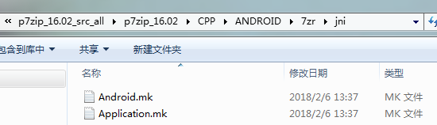

这里可以修改是生成可执行文件(动态库，或者静态库)，还有生成的平台

`Android.mk` 最下面

    # Needed since ANDROID 5, these programs run on android-16 (Android 4.1+)
    # pie是给可执行程序使用的flag
    # ndk读取mk文件编译动态库不需要指定pie
    # LOCAL_CFLAGS += -fPIE
    # LOCAL_LDFLAGS += -fPIE -pie

    # 生成可执行文件
    include $(BUILD_EXECUTABLE)
    # 生成动态库
    # include $(BUILD_SHARED_LIBRARY)
    # 生成静态库
    # include $(BUILD_STATIC_LIBRARY)

`Application.mk`

    # The ARMv7 is significanly faster due to the use of the hardware FPU
    APP_ABI := armeabi armeabi-v7a x86
    # p7zip armeabi and armeabi-v7a run at the same speed (p7zip does not use FPU)
    # APP_ABI := armeabi armeabi-v7a
    #APP_PLATFORM := android-14

然后执行 `ndk-build`

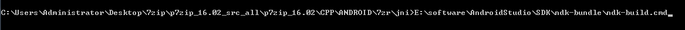

之后会在 `jni` 同级目录下生成一个 `libs` 文件夹，里面就是生成的文件

将生成的可执行文件拷贝到 `assets` 下

之后就可以在 `java` 中使用了

### 3、Android编码(NDK)的实现

将上一步生成的 `so` 动态库放入 `jniLibs`  目录下

将 `C` 文件夹和 `CPP` 文件夹拷贝到 `cpp` 目录下

配置 `CMakeLists.txt`

* 1、头文件的引入

查看Android.mk的LOCAL_CFLAGS 所有-I指定的目录（都在CPP与C目录下），写入CmakeLists.txt的include_directories节点

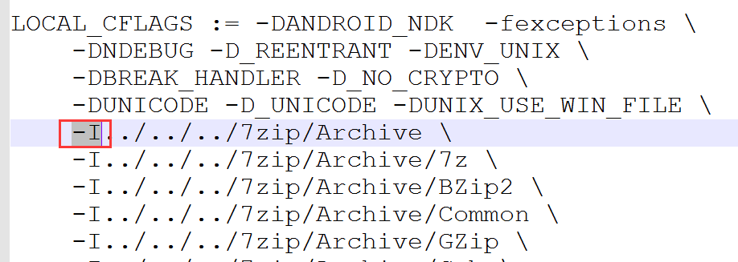

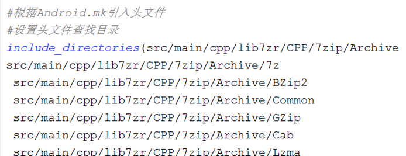

* 2、7zr的程序入口main函数

        编码实现：
            1、声明main函数
            2、解析指令
            3、调用main函数

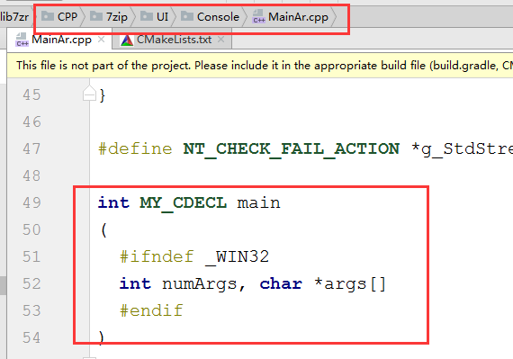

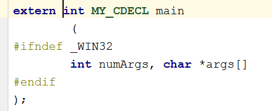

* 3、放入AS与自己编写的代码一同自动编译(和native-lib编译成同一个so库)

参考Android.mk将所有需要编译的文件(LOCAL_SRC_FILES)，写入CmakeLists.txt的add_library节点

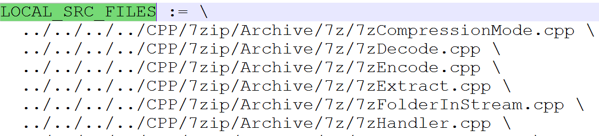

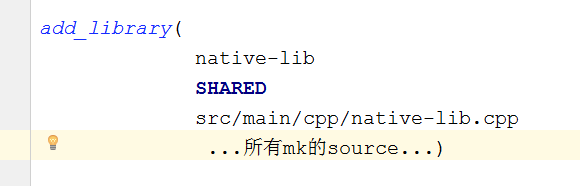